<h1> Global Analysis of Dengue Outbreaks for Hot-spot Identification </h1>

	The present preliminary analyses consists of two Cox-process models intended for hotspot identification at the country and coordinate levels. The model at the country-level takes the average number of outbreaks within each of 99 countries with a registered outbreak between 1960 and 2012, where each location corresponds to countries' centroids. The coordinates model uses the total number of outbreaks between 1960 and 2012, where the global coordinate space is divided into a grid at an arbitrary resolution, so outbreak counts occur at each quadrant of the grid.  

<h1> Data </h1>

 The dataset consists of location (geographical coordinate) of dengue outbreaks, worldwide, from 1960 to 2012. Averaged over years the number of outbreaks are distributed as in the figure below. 

	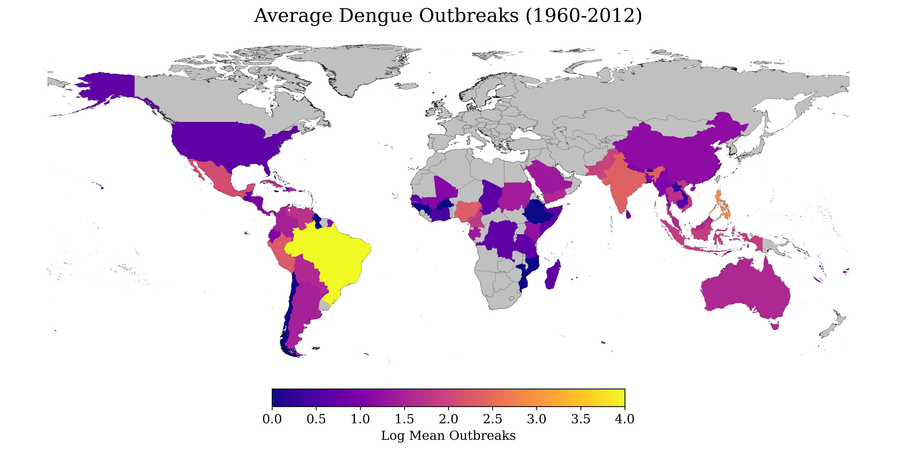

 The yearly distribution tends to concentrate on later years, as seen below. Second figure below shows the grid used for the analysis of the coordinate-level model.

	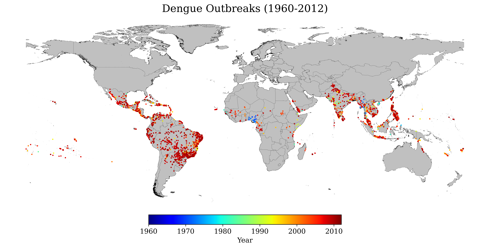

	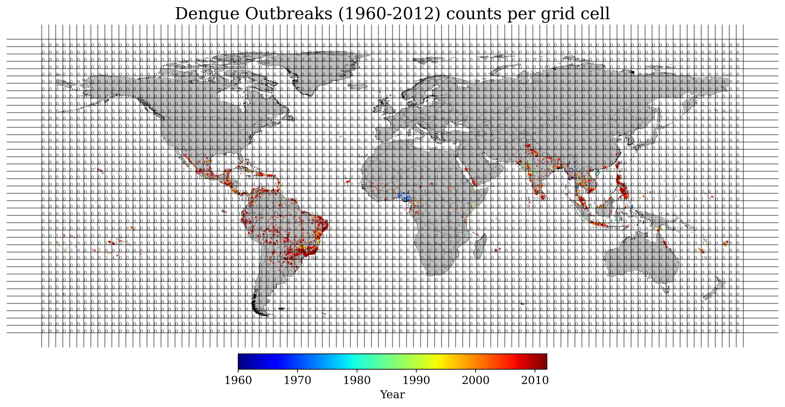

<h1> Model 1 </h1>

 For the country model we use a zero-inflated Poisson (ZIP) likelihood with expected proportion of Poisson variates <i>a</i> and with intensity as a Gaussian process <i>fc</i> , c = 1...99 countries, with covariance <i>Km,n</i>, which corresponds to a covariance over longitude <i>m</i> and latitude <i>n</i> via an exponential quadratic kernel with length scale <i>s</i>. 

	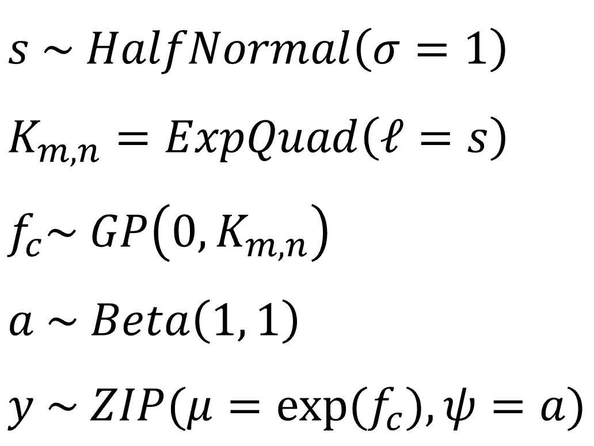

 The longitudinal-latitudinal coordinates (m,n) correspond to the centroids of each country within a WGS 84 coordinate system. The observed variable for the likelihood <i>y</i> corresponds to the count of dengue outbreaks per country averaged between the years 1960-2012. 
   

<h1> Model 2 </h1>

 For the coordinate-level model we use a Cox process with a negative binomial likelihood with a Gaussian process intensity <i>&lambda;</i> with covariance given by the Kronecker product of two exponential quadratic kernels, one per longitude <i>m</i> and latitude <i>n</i>. 

	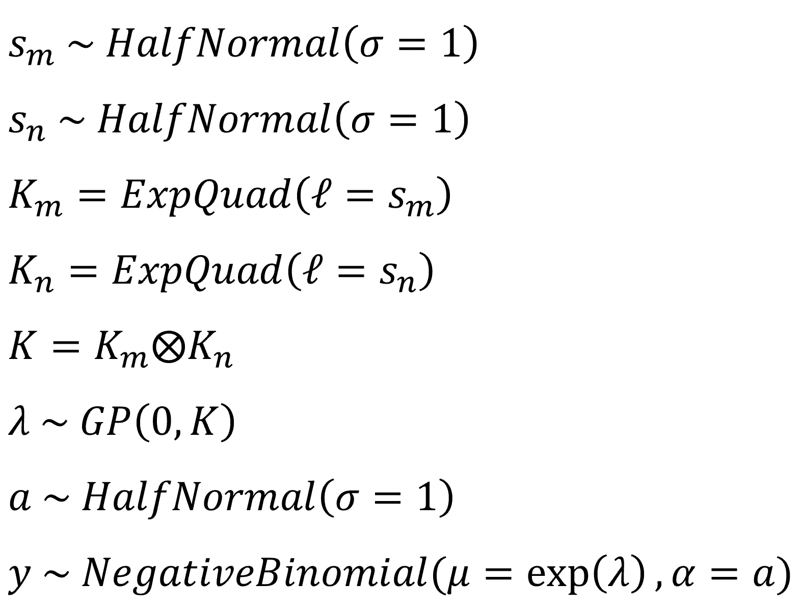

 The longitudinal-latitudinal coordinates (m,n) correspond to the centroids of each quadrant in a 100 by 40 (lon by lat) grid segmenting a global map within a WGS 84 coordinate system. The observed variable for the likelihood <i>y</i> corresponds to the count of dengue outbreaks within each quadrant along the years 1960-2012. 
  

<h1> Results </h1>

 Model 1 was sampled with 4 chains of 1000 tuning steps and 1000 samples each (target_accept=0.9), and Model 2 was sampled with 4 chains of 2000 tuning steps and 2000 samples each (target_accept=0.95). Both models sampled well with all ESS > 1000 and all R-hats <= 1.01. Relevant parameters show good chain mixing: 

	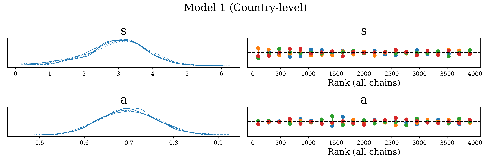

	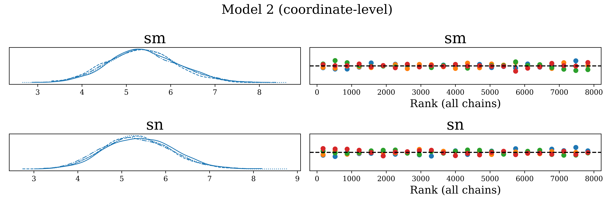

 The country model estimates a length-scale of 2.9 (90% HDI: [1.4, 4.5]) and a proportion of Poisson variates of 0.7 (90% HDI [0.6, 0.8]) . The coordinate-level model estimates length-scales of 5.4 (90% HDI: [4.1, 6.6]) and 5.4 (90% HDI: [4.1, 6.7]) for <i>m</i> and <i>n</i> coordinate ranges respectively.    

 The estimated intensity (posterior mean) at the country level indicates a clear concentration of outbreaks across countries within/overlapping the tropics. It is also estimated that the intensity of neighbouring countries increases. Note that as number of detected outbreaks increases, uncertainty decrease (e.g. see Brazil). These results may still be sensitive to under-detection of outbreaks in some countries. 

	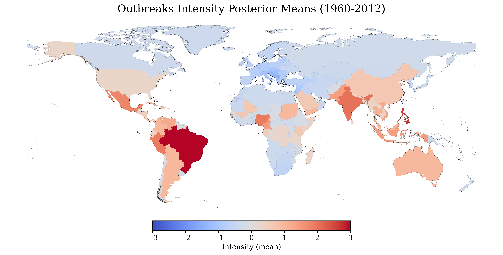

	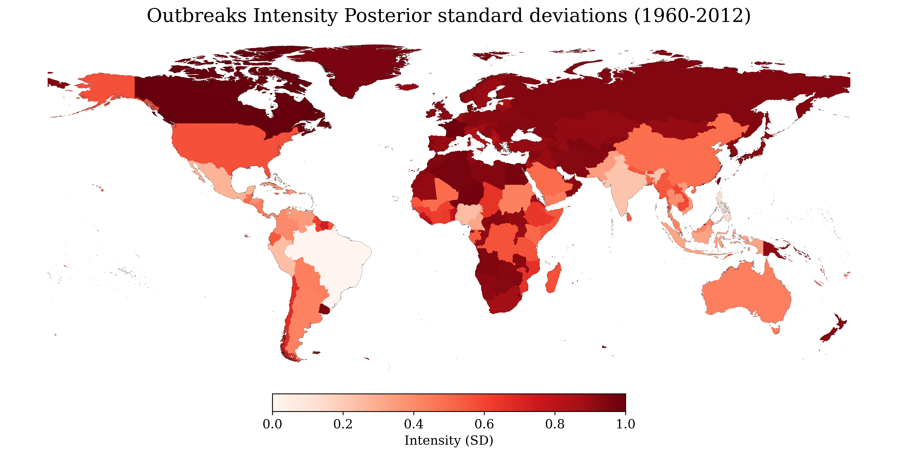

 Estimates from the coordinate level model indicate similar results, with improved resolution over specific locations (i.e. within country and overlapping countries). The model cannot distinguish between landmass and sea areas around clusters, which is an element to be improved. Even so, the heatmap below conveys a clear clustering of dengue outbreaks hotspots. 

	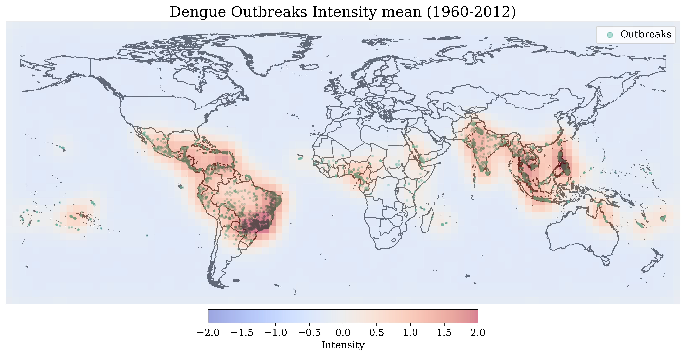

	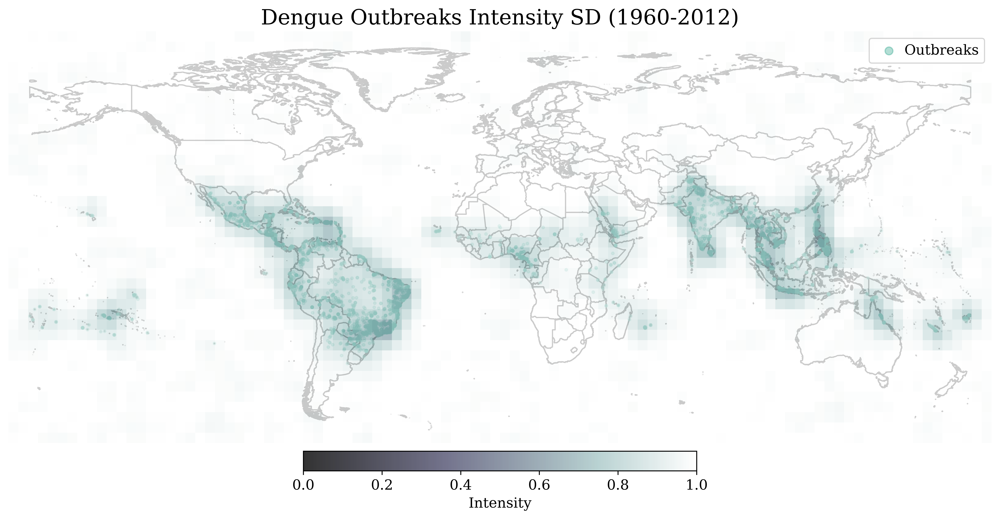

	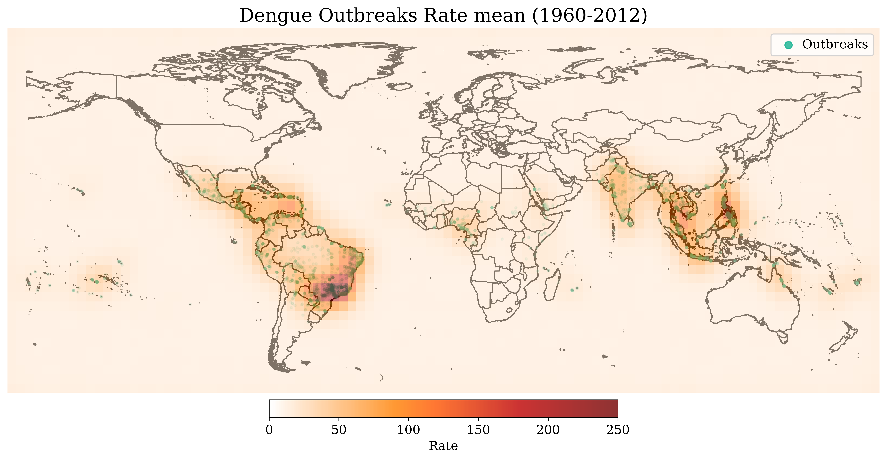

<h1> Conclusion </h1>

 Models show to be a good compliment and are able to provide good inference at the country and coordinate level. In addition, models convey a good sense of uncertainty of the estimates. In addition, by using clear thresholding approaches, the models could be used for hotspot classification. Although models could be used for prediction, their predictive capacity remains to be tested, in particular via model comparison within a Bayesian workflow approach.  

